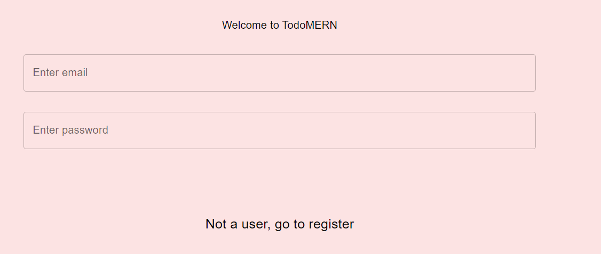
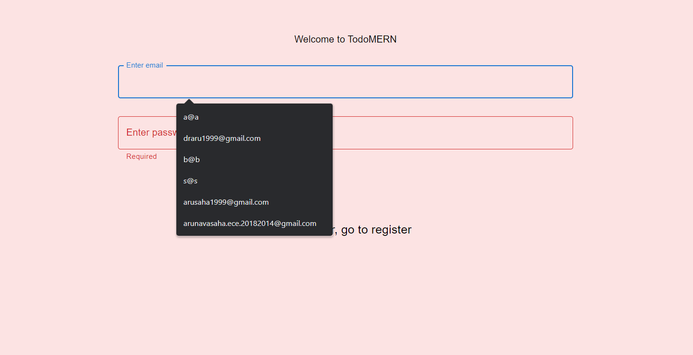
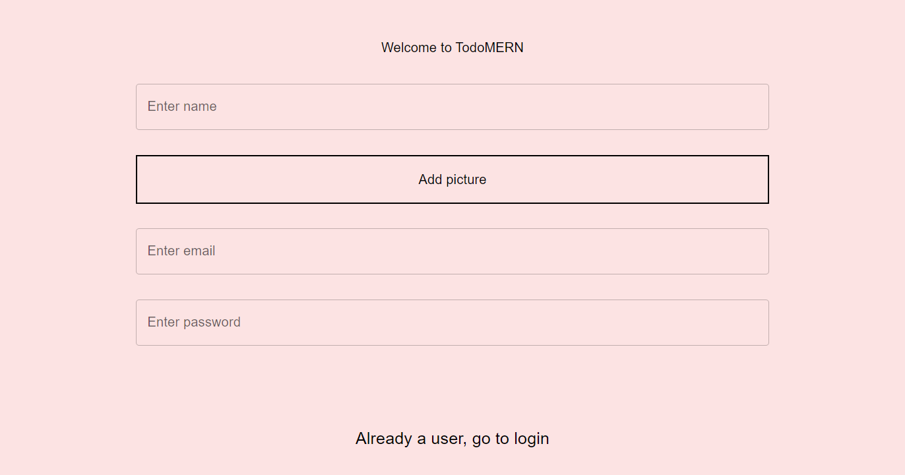
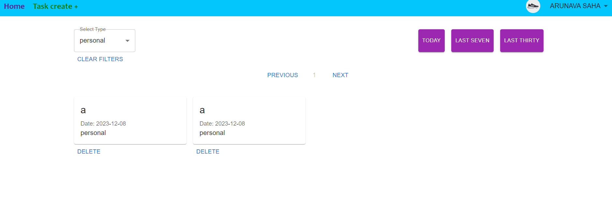
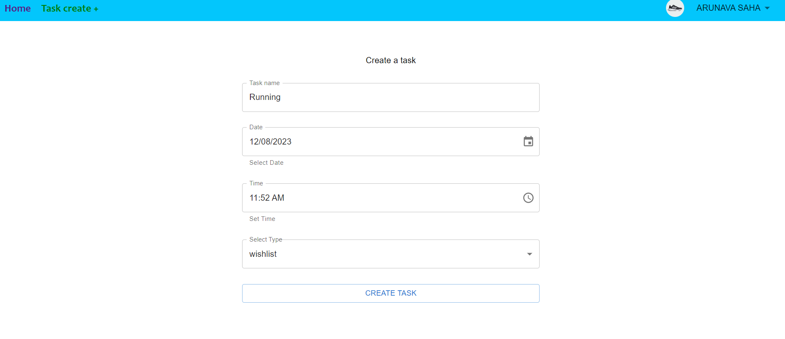
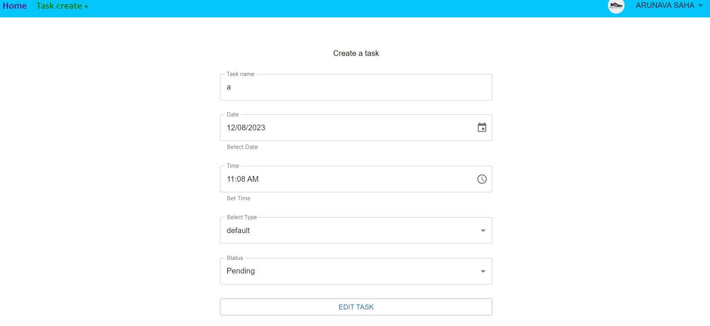
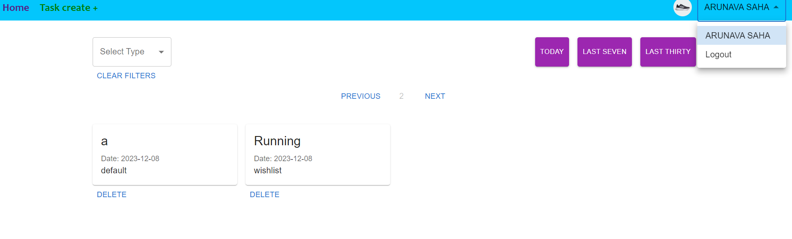

## Todo List

**Todo List** is a React app for tracking your daily Todos.

You can specify the days of the week to perform the certain Task and the deadline time.

**You can add a Task to complete one of your habits by a certain date**. You can specify and filter the type of work.

## Application demo

### Login page




### Register page



### Home Page



### Create & Edit page




### Logout Page



## Installation

### for both client and server

1. Install Node.js _(in case you haven't installed it)_.
2. [Download the source code](https://github.com/arunava-saha/todoMERN.git) and open a command prompt in the project's root folder.

```
cd todoMERN
```

2.1. split the terminal and goto each folder.

client foldier

```
cd client
```

server folder

```
cd server
```

3. Install the dependencies needed for the application.

```
npm install
```

4. Start React project and development server.

```
npm start
```

## Libraries and tools

This app's frontend part was built using **Create React App**, **Redux Toolkit**, **React Router** frontend library and also with the help of **MUI**.
This app's backend was built using **Express**, **Mongoose**, **multer**, **jsonwebtoken**, **bcrypt** library.
